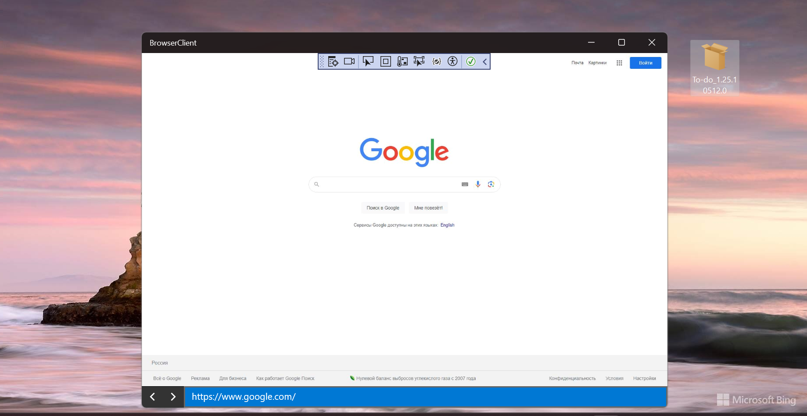
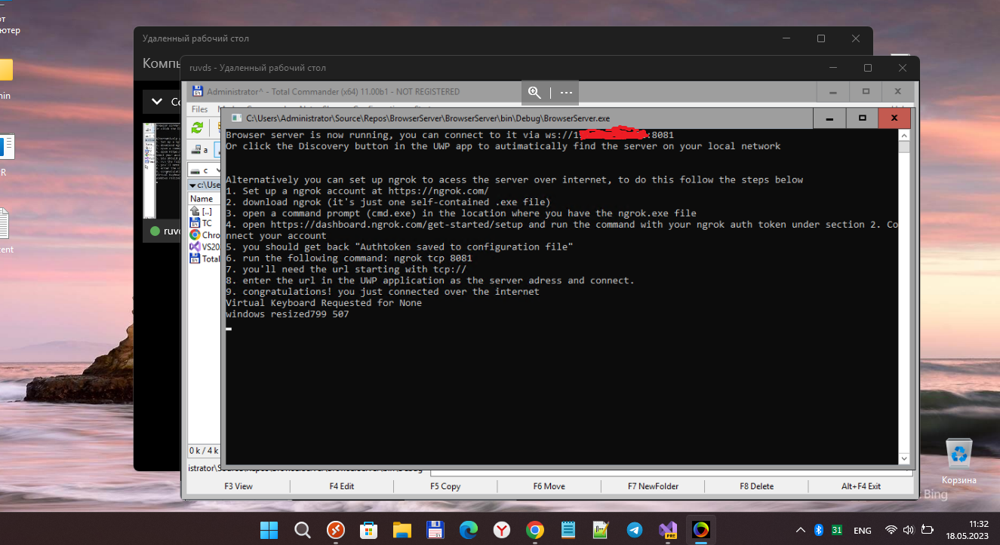

# Windows-Mobile-Browser-Streaming V2.0.3
It's my fork of very special software to "run" chromium on your windows phone (clieent-server tech. used!)

## Screenshots

## Current Status
- New version (or "iteration") with minimal improvements (some try..catch blocks added only!)
- Ready Targets: W10M ARM (min. os. build 15063) / Win10 or 11 (UWP)
- Real dedicated server used with real ip and 8081 port connection allowed

## TODO
- do somthing special (improve streaming?)
- ...

## Few words from the author (PrayK)

"

**Currently a proof of concept** inspired by [browservice](https://github.com/ttalvitie/browservice).

This was hacked together in a few days, much of it is hardcoded & the code is pretty ugly (for now) but it works.

When it grows up it aims to be a usable modern browser for windows mobile devices that anyone can install on a PC (server) and have an up to date web browser on WP (client).

### How to try
For now your phone and your server needs to be on the same network

1. Download the latest [release](https://github.com/PreyK/Windows-Mobile-Browser-Streaming/releases). 
2. Run the server app on your PC
3. Open the client app on your phone, enter the IP of the server (your PC's local IP in `ws://localip:8081` format) and click connect
4. Navigate to a page or search using google

### What works
- [x] 2 way communication with websockets and JSON
- [x] Render buffer forwarding to a UWP client
- [x] Navigation events from UWP client
- [x] Touch input events (only 1 for now) from UWP client

### What's needed
- [X] Auto finding the server if on local connection (UDP discovery packets)
- [X] Easy&secure remote connections via tunnels (Ngrok, ZeroTier, serveo)
- [X] Auto scaling renderview based on screen resolution/rotation/UWP viewport
- [ ] HiDPI
- [ ] Multitouch
- [X] Text input (basic, still WIP)
- [x] Auto save the last server address
- [ ] Faster rendering (GPU?)
- [ ] Faster & smarter transport (chunking?, rawbytes?, SYN/ACK)
- [ ] Configurable streaming quality (ondemand rendering?)
- [ ] Audio playback forwarding
- [ ] File uploads
- [ ] File downloads
- [ ] Camera & microphone
- [ ] Notifications

### What's needed after
- [ ] Tabs
- [ ] In Private/Incognito
- [ ] Back/Forward
- [ ] General browser stuff
- [ ] Continuum support/verify

### How can you help
* XAML! I don't like XAML. If you are a seasoned UWP/XAML/Windows Phone developer feel free to suggest changes.
* UWP peformance & memory management. Yes, C# has GC so one might as well use it but still. If you have any cool tips on how can I make the UWP app faster besides getting down the memory allocations let me know.
* We need a real name for the project
* Report issues you encounter on the GitHub page
* I don't do much user-facing stuff, If you find this useful and have the time make guides/tutorials for the less tech-savy :) 

"

## ..
As-is. No support. RnD only!

## .
[m][e] 2023