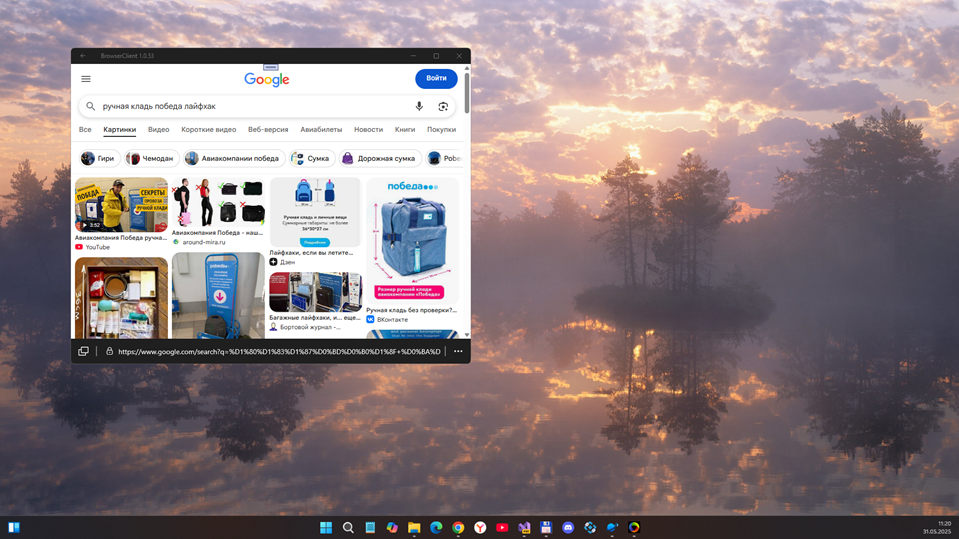
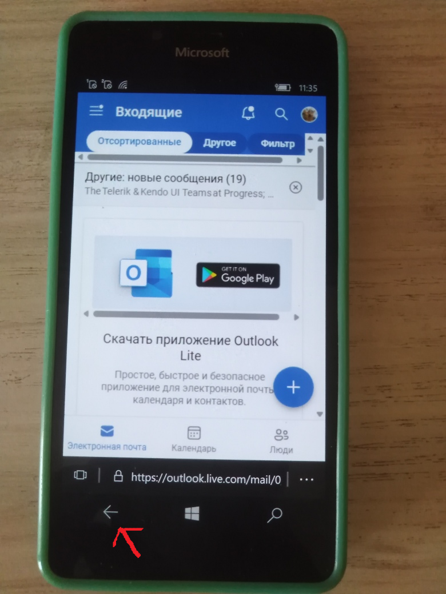

# Windows-Mobile-Browser-Streaming v1.0.52.0 - dev branch

It's my fork of very special [Client-Server software to "run" Chromium on my windows phone](https://github.com/PreyK/Windows-Mobile-Browser-Streaming). WMBS, in short. :)
 In may 2025 I detected another WMBS fork (2 repos https://https://github.com/Storik4pro/Server-Deployment-Assistant & https://github.com/Storik4pro/LBrowser) and plannedto merge it ...  

## Current Status
- Veeery quick/fast  https://https://github.com/Storik4pro/Server-Deployment-Assistant & https://github.com/Storik4pro/LBrowser "code injection" into my *dev* branch for future experiment(ation)s :)
- Ready Targets: W10M ARM (min. os. build 15063) / Win10 or 11 (UWP)
- local ip and 8081 port used, remote connection allowed for firewall

## Screenshot(s)

### How to try
For now your phone and your "server" (home pc) needs to be on the same network
1. Use VS 2022 to open WMBS solution and to build (assemble) BrowserClient and BrowserServer projects.  
2. Run BrowserServer (the server app) on your PC
3. Open BrowserClient (the client app) on your phone, enter the IP of the server (your PC's local IP in `ws://localip:8081` format) and click connect
4. Navigate to a page or search using google

### What works
- [x] 2 way communication with websockets and JSON
- [x] Render buffer forwarding to a UWP client
- [x] Navigation events from UWP client
- [x] Touch input events (only 1 for now) from UWP client
- [X] Auto finding the server if on local connection (UDP discovery packets)
- [X] Easy&secure remote connections via tunnels (Ngrok, ZeroTier, serveo)
- [X] Auto scaling renderview based on screen resolution/rotation/UWP viewport
- [X] Text input (basic, still WIP)
- [x] Auto save the last server address
- [+-] Audio playback forwarding (needs more test&fix)

## What's needed
- [ ] HiDPI
- [ ] Multitouch
- [ ] Faster rendering (GPU?)
- [ ] Faster & smarter transport (chunking?, rawbytes?, SYN/ACK)
- [ ] Configurable streaming quality (ondemand rendering?)
- [ ] File uploads
- [ ] File downloads
- [ ] Camera & microphone
- [ ] Notifications

## What's needed after
- [ ] Tabs
- [ ] In Private/Incognito
- [ ] Back/Forward
- [ ] General browser stuff
- [ ] Continuum support/verify

## How can you help
* XAML improvements. If you are a seasoned UWP/XAML/Windows Phone developer feel free to suggest changes.
* UWP peformance & memory management. Yes, C# has GC so one might as well use it but still. If you have any cool tips on how can I make the UWP app faster besides getting down the memory allocations let me know.
* We need a real name for the project
* Report issues you encounter on the GitHub page
* I don't do much user-facing stuff, If you find this useful and have the time make guides/tutorials for the less tech-savy :) 

## References
- https://www.reddit.com/r/windowsphone/comments/1kxqu4t/running_modern_websites_on_my_lumia/ Running Modern Sites theme on r/windowsphone reddit (May, 28 2025)
- https://github.com/PreyK  :: The original Windows-Mobile-Browser-Streaming's C# Developer
- https://github.com/PreyK/Windows-Mobile-Browser-Streaming  :: Windows-Mobile-Browser-Streaming, indeed :)
- https://github.com/Storik4pro/LBrowser LinesBrowser, analog of BrowserClient
- https://https://github.com/Storik4pro/Server-Deployment-Assistant SDA, analog of BrowserServer
- https://https://github.com/Storik4pro Author of SDA & LBrowser

## ::
As-is. No support. RnD only. DIY

## :
MediaExplorer 2025